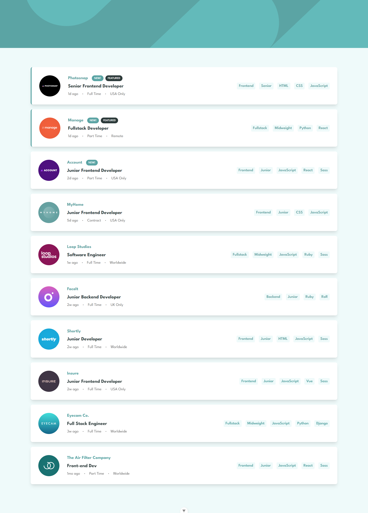

# Frontend Mentor - Job listings with filtering solution

This is a solution to the [Job listings with filtering challenge on Frontend Mentor](https://www.frontendmentor.io/challenges/job-listings-with-filtering-ivstIPCt).  

## Table of contents

- [Overview](#overview)
  - [The challenge](#the-challenge)
  - [Screenshot](#screenshot)
- [Built with](#built-with)
- [Author](#author)
- [Acknowledgments](#acknowledgments)

## Overview

### The challenge

Users should be able to:

- View the optimal layout for the site depending on their device's screen size
- See hover states for all interactive elements on the page
- Filter job listings based on the categories

### Screenshot

## Built with

- Vue.js 3
- TailwindCSS

## Author

- Website - [Inacio Nakiti](https://www.inacionakiti.com)
- Frontend Mentor - [@InacioNakiti](https://www.frontendmentor.io/profile/InacioNakiti)

## Acknowledgments

- [Vue.js Documentation](https://vuejs.org/guide/introduction.html)
- [TailwindCSS Documentation](https://tailwindcss.com/docs/installation)
